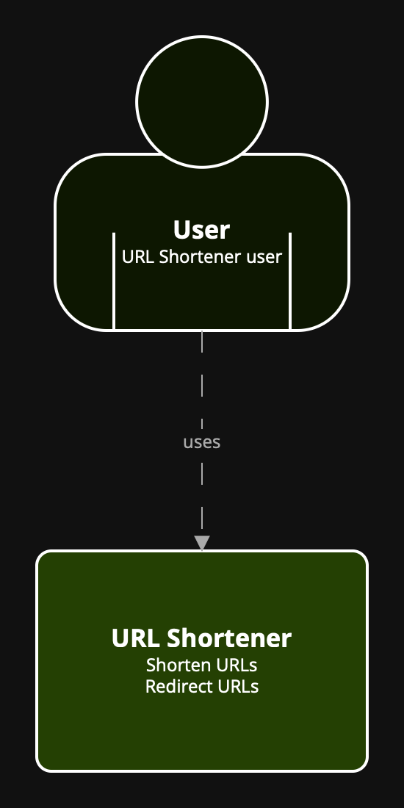

# URL Shortener

## Use Cases

### General

* Пользователь отправляет запрос с ссылкой которую хочет сократить c помощью cURL

  Параметр|Значение по умолчанию|Описание
  -|-|-
  expiration | 1 сутки | время действия ссылки
  prefix | пустая строка | префикс ссылки

* В ответ получает короткую ссылку
* При использовании короткой ссылки будет перенаправлен по оригинальной
* Если время ссылки истекло, пользователь получит в ответ статическую страницу с информацией о том что ссылка не существовала либо уже не валидна

### WebUI

Все то же что описано в General, с помощью SPA (Single Page Application) WebUI

### Telegram

Все то же что описано в General, с помощью бота в Telegram

## Architecture

### System 

### Container

